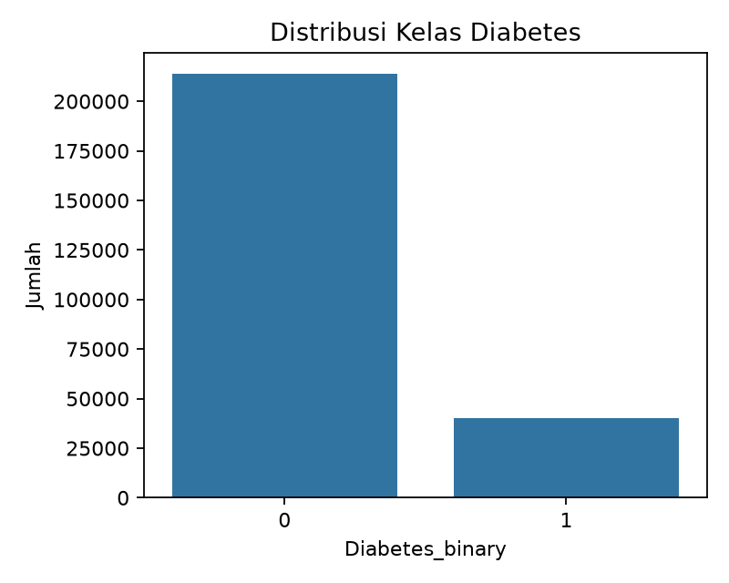
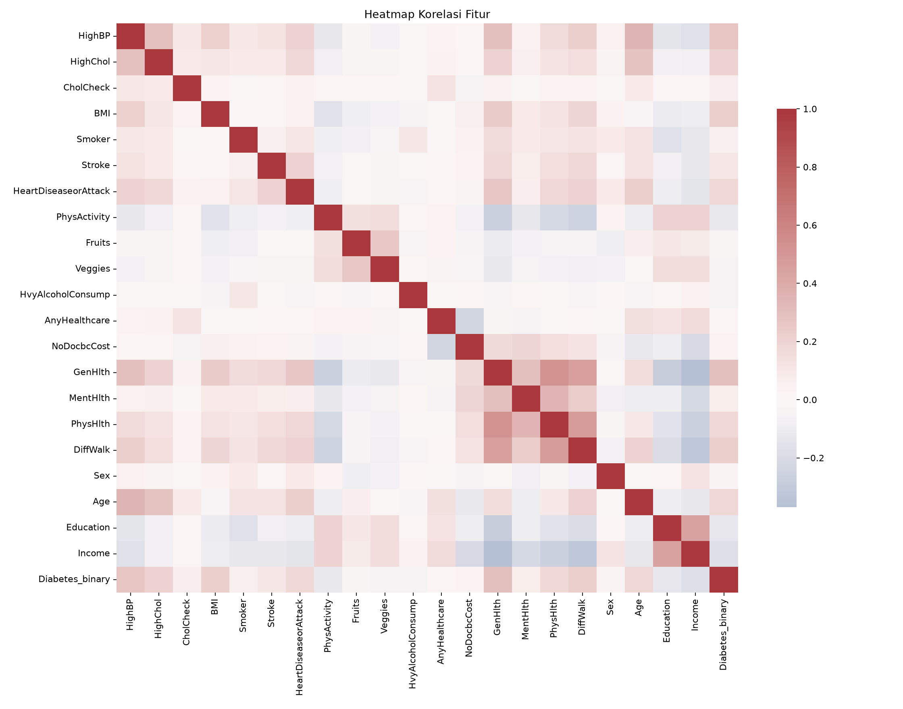
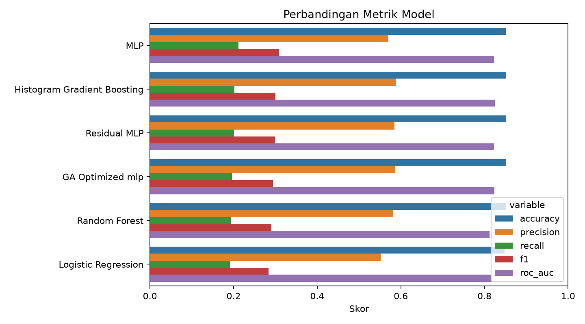
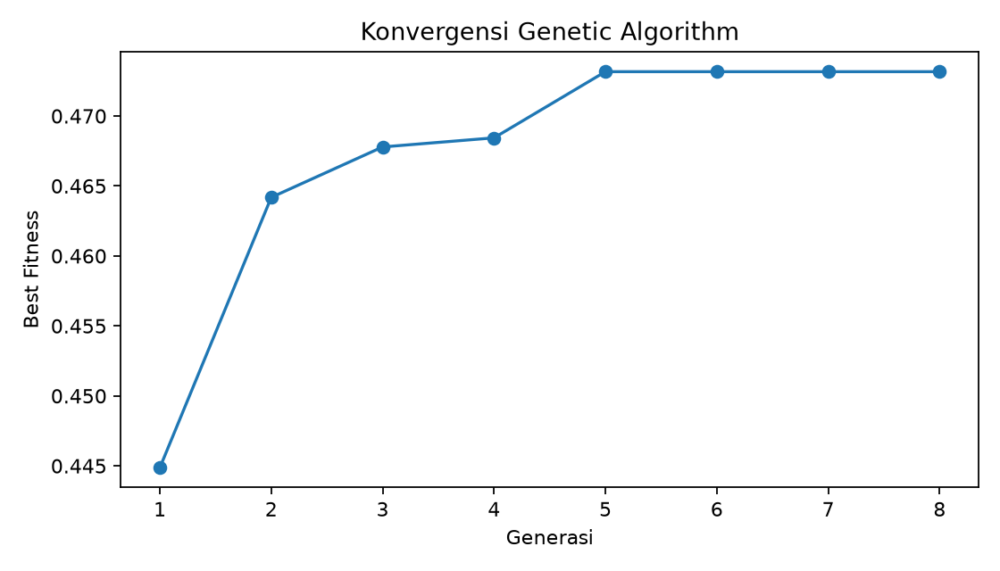
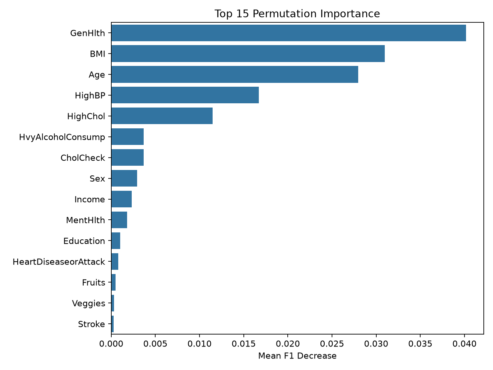
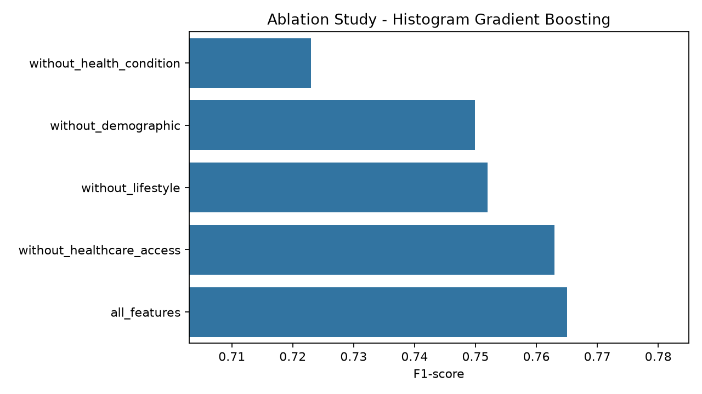
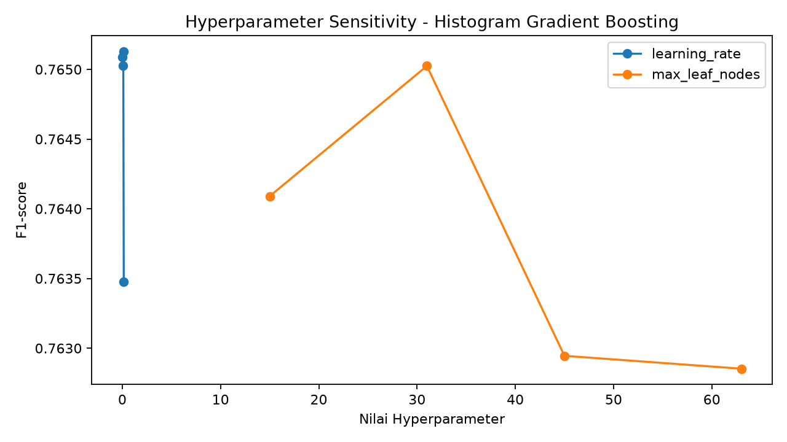
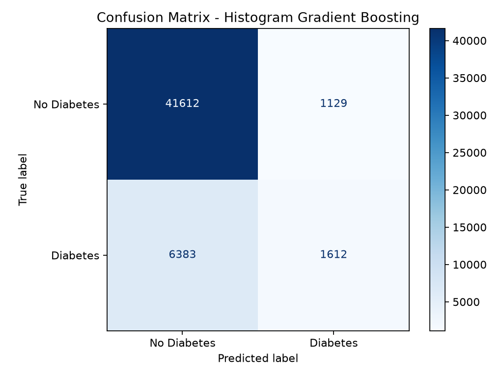
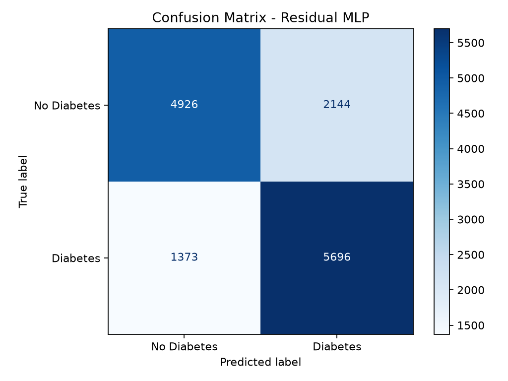
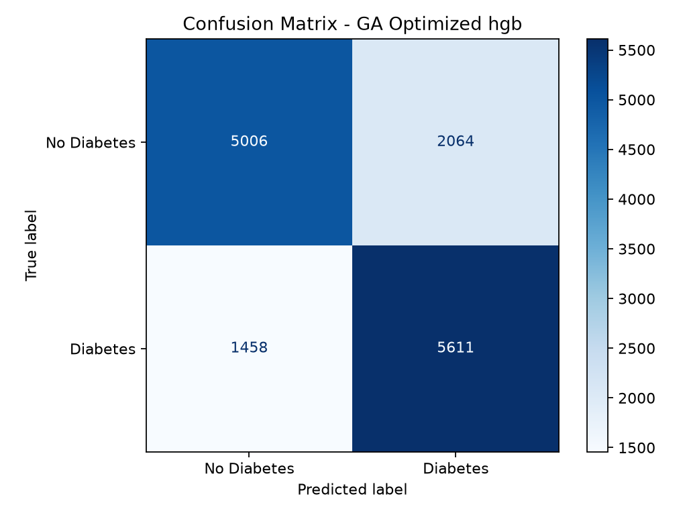

# Studi komparatif ML klasik, deep learning, dan Genetic Algorithm untuk prediksi diabetes

Repository ini berisi kode dan hasil eksperimen untuk tugas UAS Kecerdasan Komputasi. Kasus yang dipakai adalah prediksi diabetes dari data survei kesehatan, lalu hasilnya dibandingkan antara machine learning klasik, ANN/deep learning, dan Genetic Algorithm.

Dataset yang digunakan adalah Diabetes Health Indicators Dataset dari Kaggle oleh Alex Teboul. Data ini berasal dari Behavioral Risk Factor Surveillance System (BRFSS) 2015 CDC. File yang dipakai adalah `diabetes_binary_5050split_health_indicators_BRFSS2015.csv`, yaitu versi klasifikasi biner dengan jumlah kelas diabetes dan non-diabetes yang sama.

Sumber dataset: https://www.kaggle.com/datasets/alexteboul/diabetes-health-indicators-dataset

## Tujuan penelitian

Penelitian ini mencoba menjawab pertanyaan sederhana: model mana yang paling masuk akal untuk memprediksi diabetes dari indikator kesehatan, kebiasaan hidup, akses layanan kesehatan, dan data demografi. Jadi yang dilihat bukan hanya skor akurasi, tetapi juga F1-score, ROC-AUC, waktu komputasi, interpretasi fitur, dan dampak pemilihan fitur.

Pendekatan yang dibandingkan:

- Machine Learning klasik: Logistic Regression, Random Forest, Histogram Gradient Boosting
- Deep Learning/ANN: MLP, Residual MLP
- Evolutionary Computation: Genetic Algorithm untuk seleksi fitur dan optimasi hyperparameter model terbaik

## Dataset

Dataset memiliki 70.692 baris dan 22 kolom. Dari jumlah itu, 21 kolom dipakai sebagai fitur input dan 1 kolom menjadi target.

Target:

- `Diabetes_binary = 0`: responden non-diabetes
- `Diabetes_binary = 1`: responden diabetes

Distribusi target:

| Kelas | Jumlah |
|---|---:|
| 0 / Non-diabetes | 35.346 |
| 1 / Diabetes | 35.346 |

Pada file yang dipakai, tidak ditemukan missing value. Karena jumlah kelas sudah seimbang, accuracy tetap dicatat, tetapi pembacaan hasil lebih banyak mengacu pada precision, recall, F1-score, dan ROC-AUC.

Fitur yang tersedia:

| Kelompok | Fitur |
|---|---|
| Kondisi kesehatan | `HighBP`, `HighChol`, `Stroke`, `HeartDiseaseorAttack`, `DiffWalk`, `GenHlth`, `MentHlth`, `PhysHlth` |
| Perilaku/gaya hidup | `BMI`, `Smoker`, `PhysActivity`, `Fruits`, `Veggies`, `HvyAlcoholConsump` |
| Akses kesehatan | `CholCheck`, `AnyHealthcare`, `NoDocbcCost` |
| Demografi | `Sex`, `Age`, `Education`, `Income` |

## Analisis dataset

Jumlah data untuk kelas 0 dan kelas 1 sama besar. Ini membuat perbandingan model lebih bersih, karena model tidak bisa terlihat baik hanya dengan menebak kelas yang paling banyak. Dari sini, F1-score dan ROC-AUC lebih berguna untuk membaca performa dibanding accuracy saja.



Heatmap korelasi memberi gambaran awal bahwa beberapa variabel kesehatan dan demografi berhubungan dengan target. Nama fitur yang muncul, seperti `GenHlth`, `BMI`, `Age`, `HighBP`, dan `HighChol`, juga masih masuk akal jika dilihat dari konteks risiko diabetes.



Catatan dari dataset:

- Data berbentuk tabular, bukan gambar atau teks.
- Jumlah fitur tidak terlalu besar, yaitu 21 fitur.
- Banyak fitur bersifat biner atau ordinal.
- Tidak terdapat missing value.
- Target sudah seimbang, sehingga masalah imbalance tidak dominan.
- Karena data berasal dari survei, masih ada kemungkinan noise, misalnya jawaban responden yang kurang akurat atau kondisi kesehatan yang disederhanakan menjadi pilihan angka.

## Metodologi eksperimen

Data dibagi menggunakan stratified split:

- Training set: 80%
- Testing set: 20%
- Random state: 42

Preprocessing yang dipakai:

- Pemisahan fitur dan target.
- Standardisasi fitur menggunakan `StandardScaler` di dalam pipeline.
- Evaluasi model pada test set yang sama.

Metrik evaluasi:

- Accuracy
- Precision
- Recall
- F1-score
- ROC-AUC
- Waktu training
- Waktu inference

Model baseline diperingkatkan berdasarkan F1-score dan ROC-AUC. Model dengan hasil paling baik kemudian dipakai sebagai kandidat untuk optimasi Genetic Algorithm.

## Hasil perbandingan model

Tabel berikut adalah hasil eksperimen yang sudah tersimpan di folder `outputs/`.

| Ranking | Model | Accuracy | Precision | Recall | F1-score | ROC-AUC | Training Time |
|---:|---|---:|---:|---:|---:|---:|---:|
| 1 | Histogram Gradient Boosting | 0.7544 | 0.7334 | 0.7995 | 0.7650 | 0.8302 | 1.83s |
| 2 | Residual MLP | 0.7513 | 0.7265 | 0.8058 | 0.7641 | 0.8289 | 4.00s |
| 3 | MLP | 0.7516 | 0.7319 | 0.7940 | 0.7617 | 0.8278 | 1.15s |
| 4 | GA Optimized HGB | 0.7509 | 0.7311 | 0.7937 | 0.7611 | 0.8276 | 0.54s |
| 5 | Random Forest | 0.7443 | 0.7253 | 0.7865 | 0.7547 | 0.8241 | 0.86s |
| 6 | Logistic Regression | 0.7458 | 0.7372 | 0.7639 | 0.7503 | 0.8232 | 0.03s |

Visualisasi perbandingan metrik:



## Analisis hasil

Pada baseline, Histogram Gradient Boosting berada di posisi pertama dengan F1-score 0.7650 dan ROC-AUC 0.8302. Untuk data tabular seperti ini, hasil tersebut cukup masuk akal karena boosting dapat menangani campuran fitur biner, ordinal, dan numerik tanpa banyak rekayasa fitur tambahan.

Residual MLP menarik karena recall-nya paling tinggi, yaitu 0.8058. Model ini lebih sering menangkap responden diabetes, tetapi precision-nya kalah dari Logistic Regression dan Histogram Gradient Boosting. Jadi, kelebihannya ada pada sensitivitas, dengan konsekuensi false positive yang lebih besar.

Logistic Regression menjadi baseline yang paling hemat komputasi. Training selesai sekitar 0.03 detik dan precision-nya justru paling tinggi, yaitu 0.7372. Namun, F1-score 0.7503 dan recall 0.7639 masih di bawah model ensemble.

Random Forest berada di tengah. Skornya tidak buruk, tetapi belum melampaui Histogram Gradient Boosting. Pada eksperimen ini, model boosting lebih unggul karena proses training-nya memperbaiki kesalahan secara bertahap dari iterasi ke iterasi.

## Optimasi Genetic Algorithm

Genetic Algorithm diterapkan pada baseline terbaik, yaitu Histogram Gradient Boosting. GA dipakai untuk dua hal:

- Seleksi fitur
- Optimasi hyperparameter

Konfigurasi terbaik GA:

| Komponen | Nilai |
|---|---:|
| Model family | Histogram Gradient Boosting |
| Learning rate | 0.0536 |
| Max iterations | 160 |
| Max leaf nodes | 45 |
| L2 regularization | 0.0420 |
| Fitness terbaik | 0.7702 |

Fitur yang dipilih GA:

`HighBP`, `HighChol`, `BMI`, `Smoker`, `Stroke`, `HeartDiseaseorAttack`, `HvyAlcoholConsump`, `AnyHealthcare`, `GenHlth`, `PhysHlth`, `Sex`, `Age`, `Education`, `Income`

Kurva konvergensi GA:



GA memilih 14 dari 21 fitur. Modelnya jadi lebih ringkas, tetapi skor pada test set sedikit turun dibanding Histogram Gradient Boosting awal. Dari hasil ini, GA lebih terlihat membantu pengurangan fitur daripada menaikkan akurasi model.

## Interpretabilitas

Permutation importance dipakai untuk mengecek fitur mana yang paling memengaruhi F1-score. Lima fitur teratas adalah:

| Ranking | Fitur | Importance Mean |
|---:|---|---:|
| 1 | `GenHlth` | 0.0402 |
| 2 | `BMI` | 0.0310 |
| 3 | `Age` | 0.0280 |
| 4 | `HighBP` | 0.0167 |
| 5 | `HighChol` | 0.0115 |

Visualisasi fitur penting:



Urutan ini masih sesuai dengan konteks kesehatan. Kondisi kesehatan umum (`GenHlth`), indeks massa tubuh (`BMI`), usia (`Age`), tekanan darah tinggi (`HighBP`), dan kolesterol tinggi (`HighChol`) memang sering muncul dalam pembahasan risiko diabetes.

## Eksperimen lanjutan

### Ablation study

Ablation study dilakukan pada Histogram Gradient Boosting. Caranya adalah menghapus satu kelompok fitur, lalu membandingkan skornya dengan model yang memakai semua fitur.

| Setting | Jumlah Fitur | F1-score | Delta F1 |
|---|---:|---:|---:|
| Semua fitur | 21 | 0.7650 | 0.0000 |
| Tanpa fitur akses kesehatan | 18 | 0.7630 | -0.0021 |
| Tanpa fitur gaya hidup | 15 | 0.7520 | -0.0130 |
| Tanpa fitur demografi | 17 | 0.7499 | -0.0151 |
| Tanpa fitur kondisi kesehatan | 13 | 0.7230 | -0.0421 |



Dari ablation, kelompok kondisi kesehatan paling besar pengaruhnya. Ketika fitur seperti `HighBP`, `HighChol`, `GenHlth`, `PhysHlth`, dan riwayat penyakit dihapus, F1-score turun paling jauh. Penghapusan fitur akses kesehatan hampir tidak mengubah skor.

### Hyperparameter sensitivity analysis

Sensitivity analysis dilakukan pada Histogram Gradient Boosting dengan mengubah `learning_rate` dan `max_leaf_nodes`.

| Parameter | Nilai Terbaik pada Eksperimen | F1-score |
|---|---:|---:|
| `learning_rate` | 0.10 | 0.7651 |
| `max_leaf_nodes` | 31 | 0.7650 |



Perubahan `learning_rate` dari 0.03 sampai 0.10 tidak banyak menggeser performa. Saat dinaikkan ke 0.15, F1-score mulai turun. Untuk `max_leaf_nodes`, nilai 31 memberi skor terbaik pada percobaan ini; nilai yang lebih besar tidak memberi keuntungan yang jelas.

### Explainable AI

Explainable AI dilakukan dengan permutation importance. Metode ini dipilih karena cocok untuk data tabular dan bisa dipakai pada berbagai jenis model. Dari hasilnya, fitur yang paling berpengaruh adalah `GenHlth`, `BMI`, `Age`, `HighBP`, dan `HighChol`.

### Cross-dataset evaluation

Cross-dataset evaluation belum dilakukan karena data yang tersedia di workspace hanya satu file, yaitu BRFSS 2015 binary 50:50 split. Untuk evaluasi lintas dataset, perlu data lain, misalnya versi BRFSS dengan distribusi asli yang tidak seimbang atau data tahun berbeda. Tanpa itu, klaim generalisasi lintas dataset kurang kuat.

## Confusion matrix

Confusion matrix model terbaik baseline:



Confusion matrix model deep learning terbaik:



Confusion matrix model hasil optimasi GA:



## Kesimpulan

- Histogram Gradient Boosting menjadi pilihan utama dari eksperimen ini. Skornya paling tinggi pada F1-score 0.7650 dan ROC-AUC 0.8302, dengan accuracy 0.7544. Untuk dataset tabular BRFSS ini, model ensemble klasik masih lebih kuat dibanding model lain yang diuji.

- Residual MLP paling menonjol dari sisi recall. Nilainya mencapai 0.8058, lebih tinggi dari semua model lain. Namun F1-score-nya 0.7641, masih sedikit di bawah Histogram Gradient Boosting. Artinya, model ini lebih banyak menandai responden sebagai diabetes, dengan risiko salah positif yang lebih besar.

- Logistic Regression layak dipakai sebagai baseline sederhana. Training hanya sekitar 0.03 detik dan precision-nya 0.7372, tertinggi di tabel hasil. Kekurangannya ada pada F1-score 0.7503 dan recall 0.7639, sehingga performanya belum menyamai model ensemble.

- GA lebih berguna untuk merapikan kombinasi fitur daripada menaikkan skor akhir. Model GA Optimized HGB memakai 14 dari 21 fitur, lalu menghasilkan F1-score 0.7611 dan ROC-AUC 0.8276. Skor ini turun sedikit dari baseline HGB, tetapi penurunannya tidak besar.

- Ablation study memperjelas peran fitur kondisi kesehatan. Saat kelompok fitur ini dihapus, F1-score turun dari 0.7650 menjadi 0.7230. Selisih 0.0421 ini paling besar dibanding penghapusan kelompok fitur lain.

- Sensitivity analysis tidak menemukan perubahan ekstrem pada HGB. Pada `learning_rate` 0.03 sampai 0.10, F1-score tetap berada di sekitar 0.7650. Nilai tertinggi muncul pada `learning_rate = 0.10`, yaitu 0.7651.

- Hasil permutation importance masih selaras dengan konteks medis. Lima fitur teratas adalah `GenHlth` 0.0402, `BMI` 0.0310, `Age` 0.0280, `HighBP` 0.0167, dan `HighChol` 0.0115.

- Untuk penggunaan praktis, Histogram Gradient Boosting adalah kandidat paling masuk akal dari eksperimen ini. Modelnya tidak terlalu berat, skornya paling baik, dan fitur pentingnya masih bisa dibaca. Prediksi dari model seperti ini dapat membantu screening awal risiko diabetes, tetapi tetap tidak boleh dianggap sebagai diagnosis medis.

## Struktur repository

```text
diabetes-ci-research/
  data/
    README.md
  src/
    run_experiments.py
  outputs/
    metrics.csv
    metrics.json
    feature_summary.csv
    permutation_importance.csv
    ga_history.csv
    ga_best_config.json
    ablation_study.csv
    hyperparameter_sensitivity.csv
    plots/
  requirements.txt
  README.md
```

## Reproduksi

1. Buat virtual environment.

```bash
python -m venv .venv
```

2. Aktifkan environment.

Windows PowerShell:

```powershell
.\.venv\Scripts\Activate.ps1
```

Linux/macOS:

```bash
source .venv/bin/activate
```

3. Install dependency.

```bash
pip install -r requirements.txt
```

4. Jalankan eksperimen. Dataset sudah tersedia di folder `data/`.

```bash
python src/run_experiments.py
```

Opsional, jalankan mode ringkas untuk memastikan environment sudah benar:

```bash
python src/run_experiments.py --quick
```

Jalankan konfigurasi eksperimen yang lebih lengkap:

```bash
python src/run_experiments.py --deep-epochs 40 --ga-generations 12 --ga-population 18
```

## Output program

Semua hasil eksperimen disimpan di `outputs/`:

- `metrics.csv`: metrik semua model baseline dan model GA-optimized
- `metrics.json`: ringkasan eksperimen
- `feature_summary.csv`: statistik fitur
- `permutation_importance.csv`: interpretabilitas fitur model terbaik
- `ga_history.csv`: histori fitness GA per generasi
- `ga_best_config.json`: konfigurasi terbaik hasil GA
- `ablation_study.csv`: hasil ablation study per kelompok fitur
- `hyperparameter_sensitivity.csv`: hasil sensitivity analysis hyperparameter
- `plots/`: grafik EDA, perbandingan model, confusion matrix, dan konvergensi GA
- `models/`: model terbaik dan metadata, tidak perlu dipublish ke GitHub
