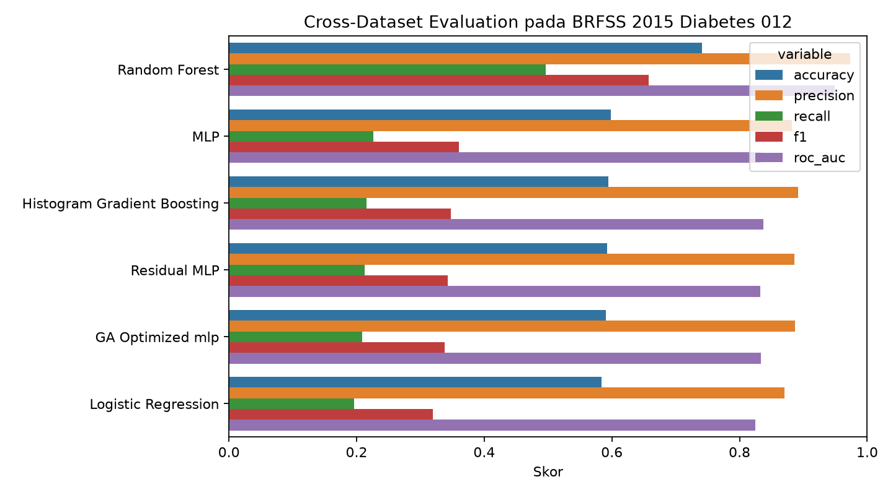
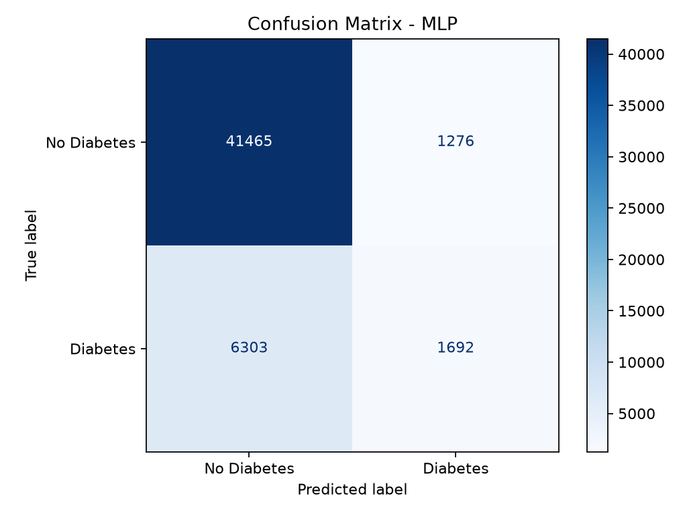
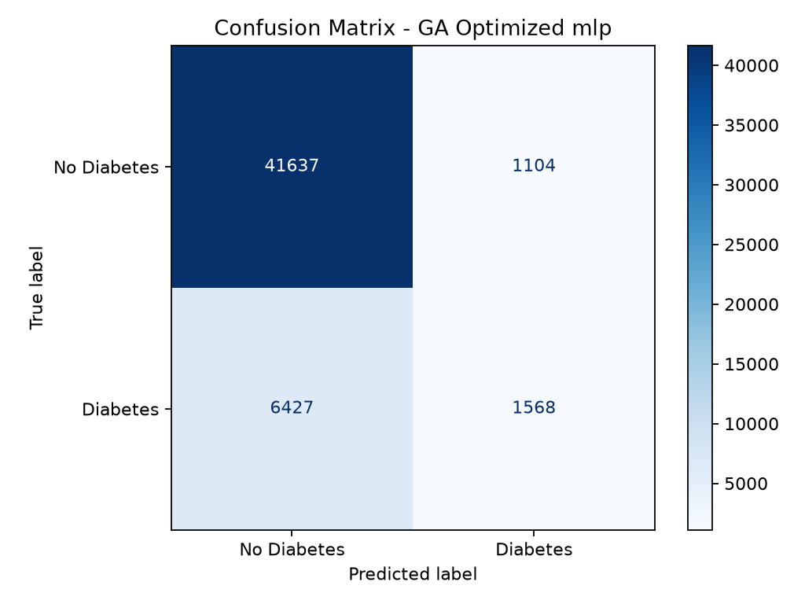

# Studi komparatif ML klasik, deep learning, dan Genetic Algorithm untuk prediksi diabetes

Repository ini berisi kode dan hasil eksperimen untuk tugas UAS Kecerdasan Komputasi. Kasus yang dipakai adalah prediksi diabetes dari data survei kesehatan BRFSS 2015, lalu hasilnya dibandingkan antara machine learning klasik, ANN/deep learning, dan Genetic Algorithm.

Dataset utama yang dipakai adalah `diabetes_012_health_indicators_BRFSS2015.csv` dari Diabetes Health Indicators Dataset Kaggle. Target asli `Diabetes_012` memiliki tiga kelas: 0 non-diabetes, 1 prediabetes, dan 2 diabetes. Pada eksperimen ini target dikonversi menjadi klasifikasi biner: nilai 0 tetap menjadi kelas 0, sedangkan nilai 1 dan 2 digabung sebagai kelas 1.

Sumber dataset: https://www.kaggle.com/datasets/alexteboul/diabetes-health-indicators-dataset

## Tujuan penelitian

Penelitian ini membandingkan model klasik, model ANN/deep learning, dan optimasi evolusioner pada data tabular kesehatan. Selain skor model, eksperimen juga melihat waktu training, interpretasi fitur, ablation study, sensitivity analysis, dan cross-dataset evaluation.

Pendekatan yang dibandingkan:

- Machine Learning klasik: Logistic Regression, Random Forest, Histogram Gradient Boosting
- Deep Learning/ANN: MLP, Residual MLP
- Evolutionary Computation: Genetic Algorithm untuk seleksi fitur dan optimasi hyperparameter model terbaik

## Dataset

Dataset utama memiliki 253.680 baris dan 22 kolom. Setelah target `Diabetes_012` dikonversi menjadi biner, distribusi kelas menjadi:

| Kelas biner | Makna | Jumlah |
|---:|---|---:|
| 0 | Non-diabetes | 213.703 |
| 1 | Prediabetes atau diabetes | 39.977 |

Dataset ini lebih tidak seimbang dibanding versi 50:50. Karena itu, accuracy tidak cukup untuk membaca performa. F1-score, recall, precision, dan ROC-AUC menjadi lebih penting.

Fitur yang tersedia:

| Kelompok | Fitur |
|---|---|
| Kondisi kesehatan | `HighBP`, `HighChol`, `Stroke`, `HeartDiseaseorAttack`, `DiffWalk`, `GenHlth`, `MentHlth`, `PhysHlth` |
| Perilaku/gaya hidup | `BMI`, `Smoker`, `PhysActivity`, `Fruits`, `Veggies`, `HvyAlcoholConsump` |
| Akses kesehatan | `CholCheck`, `AnyHealthcare`, `NoDocbcCost` |
| Demografi | `Sex`, `Age`, `Education`, `Income` |

## Analisis dataset

Distribusi kelas pada dataset utama tidak seimbang. Kelas positif hanya sekitar 15,76% dari total data. Kondisi ini membuat F1-score terlihat jauh lebih rendah dibanding eksperimen pada dataset 50:50, meskipun ROC-AUC tetap cukup tinggi.


Heatmap korelasi memberi gambaran awal bahwa fitur seperti `GenHlth`, `BMI`, `Age`, `HighBP`, dan `HighChol` masih relevan dengan target.


## Metodologi eksperimen

Data dibagi menggunakan stratified split 80:20 dengan random state 42. Standardisasi fitur dilakukan menggunakan `StandardScaler` di dalam pipeline. Model dievaluasi dengan accuracy, precision, recall, F1-score, ROC-AUC, waktu training, dan waktu inference.

Model baseline terbaik dipilih berdasarkan F1-score dan ROC-AUC. Model tersebut kemudian dioptimasi menggunakan Genetic Algorithm.

## Hasil perbandingan model

| Ranking | Model | Accuracy | Precision | Recall | F1-score | ROC-AUC | Training Time |
|---:|---|---:|---:|---:|---:|---:|---:|
| 1 | MLP | 0.8506 | 0.5701 | 0.2116 | 0.3087 | 0.8230 | 3.98s |
| 2 | Histogram Gradient Boosting | 0.8519 | 0.5881 | 0.2016 | 0.3003 | 0.8243 | 2.81s |
| 3 | Residual MLP | 0.8516 | 0.5852 | 0.2006 | 0.2988 | 0.8232 | 12.21s |
| 4 | GA Optimized MLP | 0.8516 | 0.5868 | 0.1961 | 0.2940 | 0.8237 | 3.76s |
| 5 | Random Forest | 0.8510 | 0.5822 | 0.1931 | 0.2900 | 0.8116 | 5.63s |
| 6 | Logistic Regression | 0.8481 | 0.5520 | 0.1911 | 0.2839 | 0.8172 | 0.14s |


MLP menjadi model terbaik berdasarkan F1-score, yaitu 0.3087. Histogram Gradient Boosting memiliki ROC-AUC tertinggi, yaitu 0.8243. Nilai F1-score relatif rendah karena dataset utama tidak seimbang dan model cenderung hati-hati dalam menandai kelas positif.

## Optimasi Genetic Algorithm

GA diterapkan pada model baseline terbaik, yaitu MLP. Optimasi dilakukan untuk memilih fitur dan hyperparameter. Pada eksperimen ini GA menghasilkan F1-score 0.2940 dan ROC-AUC 0.8237. Skor ini sedikit di bawah MLP baseline, tetapi tetap menunjukkan bahwa pengurangan fitur dapat dilakukan tanpa penurunan ROC-AUC yang besar.


## Interpretabilitas

Permutation importance digunakan untuk melihat fitur yang paling memengaruhi F1-score. Lima fitur teratas:

| Ranking | Fitur | Importance Mean |
|---:|---|---:|
| 1 | `BMI` | 0.1142 |
| 2 | `GenHlth` | 0.1101 |
| 3 | `HighBP` | 0.0730 |
| 4 | `HighChol` | 0.0598 |
| 5 | `Age` | 0.0165 |


Urutan ini masih sesuai dengan konteks kesehatan. BMI, kondisi kesehatan umum, tekanan darah tinggi, kolesterol tinggi, dan usia adalah indikator yang sering berkaitan dengan risiko diabetes.

## Eksperimen lanjutan

### Ablation study

Ablation study dilakukan pada Histogram Gradient Boosting. Kelompok fitur kondisi kesehatan memberi dampak terbesar.

| Setting | Jumlah Fitur | F1-score | Delta F1 |
|---|---:|---:|---:|
| Semua fitur | 21 | 0.3003 | 0.0000 |
| Tanpa fitur akses kesehatan | 18 | 0.2926 | -0.0077 |
| Tanpa fitur demografi | 17 | 0.2585 | -0.0418 |
| Tanpa fitur gaya hidup | 15 | 0.2056 | -0.0947 |
| Tanpa fitur kondisi kesehatan | 13 | 0.1431 | -0.1572 |


### Hyperparameter sensitivity analysis

Sensitivity analysis dilakukan pada Histogram Gradient Boosting dengan mengubah `learning_rate` dan `max_leaf_nodes`.


### Cross-dataset evaluation

Cross-dataset evaluation dilakukan dengan mengevaluasi model yang dilatih pada dataset utama `diabetes_012` terhadap dataset lama `diabetes_binary_5050split_health_indicators_BRFSS2015.csv`. Dataset lama tidak lagi disimpan di repository, tetapi masih dapat digunakan sebagai dataset eksternal jika tersedia.

| Ranking | Model | Accuracy | Precision | Recall | F1-score | ROC-AUC |
|---:|---|---:|---:|---:|---:|---:|
| 1 | Random Forest | 0.7414 | 0.9738 | 0.4962 | 0.6574 | 0.9494 |
| 2 | MLP | 0.5981 | 0.8824 | 0.2264 | 0.3603 | 0.8334 |
| 3 | Histogram Gradient Boosting | 0.5949 | 0.8920 | 0.2159 | 0.3476 | 0.8369 |
| 4 | Residual MLP | 0.5924 | 0.8860 | 0.2122 | 0.3424 | 0.8321 |
| 5 | GA Optimized MLP | 0.5910 | 0.8872 | 0.2085 | 0.3376 | 0.8339 |
| 6 | Logistic Regression | 0.5833 | 0.8708 | 0.1956 | 0.3195 | 0.8243 |



Hasil cross-dataset berbeda dari test set utama. Random Forest menjadi model terbaik pada dataset eksternal dengan F1-score 0.6574 dan ROC-AUC 0.9494. Ini menunjukkan bahwa ranking model dapat berubah ketika distribusi data berubah.

## Confusion matrix

Confusion matrix MLP:



Confusion matrix Histogram Gradient Boosting:


Confusion matrix model hasil optimasi GA:



## Kesimpulan

- Pada dataset utama `diabetes_012` yang dikonversi menjadi biner, MLP memperoleh F1-score tertinggi, yaitu 0.3087.
- Histogram Gradient Boosting memiliki ROC-AUC tertinggi, yaitu 0.8243, sehingga masih kuat dalam memisahkan kelas positif dan negatif.
- GA Optimized MLP belum melampaui MLP baseline. F1-score turun dari 0.3087 menjadi 0.2940.
- Ablation study menunjukkan bahwa fitur kondisi kesehatan paling penting. Saat kelompok fitur ini dihapus, F1-score turun dari 0.3003 menjadi 0.1431.
- Cross-dataset evaluation menunjukkan perubahan ranking model. Random Forest menjadi model terbaik pada dataset eksternal 50:50 dengan F1-score 0.6574 dan ROC-AUC 0.9494.
- Dataset yang tidak seimbang membuat accuracy terlihat tinggi, tetapi F1-score dan recall lebih tepat untuk membaca kemampuan model dalam mendeteksi kelas positif.

## Struktur repository

```text
diabetes-ci-research/
  data/
    README.md
    diabetes_012_health_indicators_BRFSS2015.csv
  src/
    run_experiments.py
  outputs/
    metrics.csv
    metrics.json
    cross_dataset_evaluation.csv
    feature_summary.csv
    permutation_importance.csv
    ga_history.csv
    ga_best_config.json
    ablation_study.csv
    hyperparameter_sensitivity.csv
    plots/
  requirements.txt
  README.md
```

## Reproduksi

```bash
python -m venv .venv
pip install -r requirements.txt
python src/run_experiments.py
```

Mode ringkas:

```bash
python src/run_experiments.py --quick
```

Jika dataset lama tersedia dan ingin dipakai untuk cross-dataset evaluation:

```bash
python src/run_experiments.py --cross-data path/to/diabetes_binary_5050split_health_indicators_BRFSS2015.csv
```

## Output program

- `metrics.csv`: metrik semua model baseline dan model GA-optimized
- `cross_dataset_evaluation.csv`: hasil evaluasi pada dataset eksternal
- `metrics.json`: ringkasan eksperimen
- `feature_summary.csv`: statistik fitur
- `permutation_importance.csv`: interpretabilitas fitur
- `ga_history.csv`: histori fitness GA per generasi
- `ga_best_config.json`: konfigurasi terbaik hasil GA
- `ablation_study.csv`: hasil ablation study
- `hyperparameter_sensitivity.csv`: hasil sensitivity analysis
- `plots/`: grafik EDA, model comparison, confusion matrix, GA, ablation, sensitivity, dan cross-dataset
